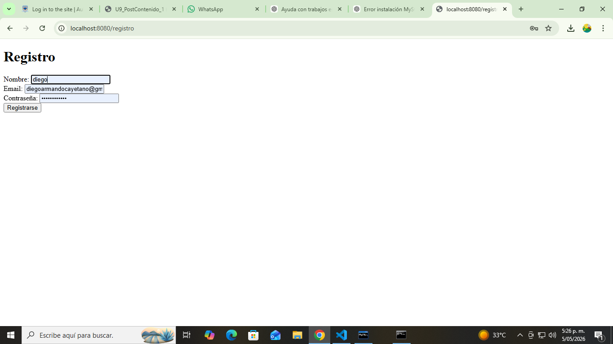
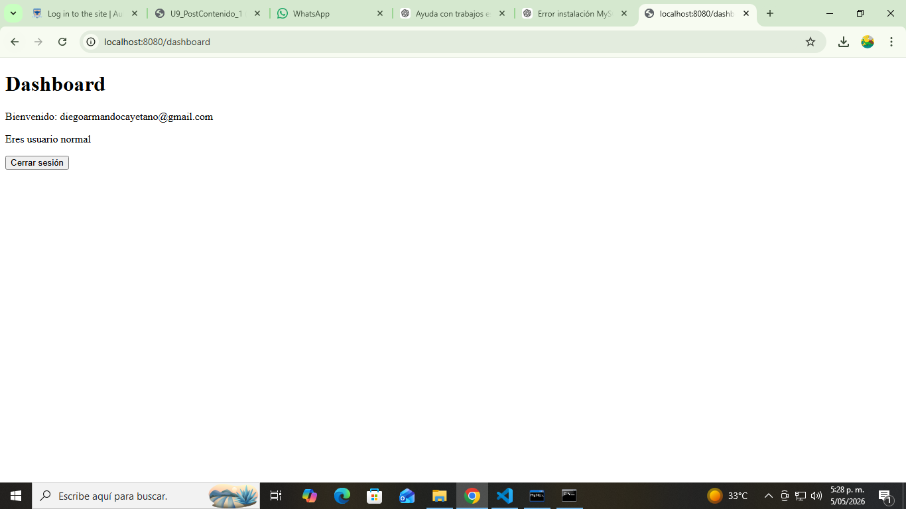
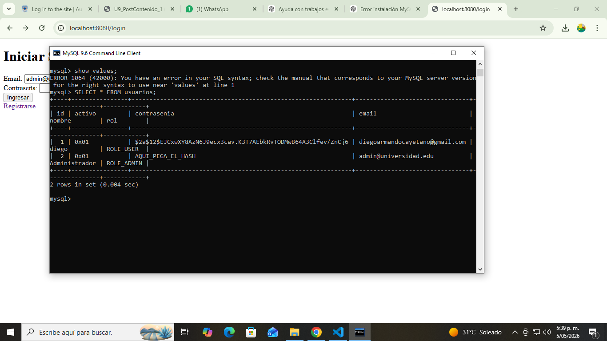

# 🔐 Sistema de Autenticación con Spring Security 6

Proyecto de la **Unidad 9 - Seguridad en Aplicaciones Web**.

---

## 🚀 Tecnologías

- Java 21  
- Spring Boot 3  
- Spring Security 6  
- MySQL  
- Spring Data JPA  
- Thymeleaf  

---

## ⚙️ Configuración

### 📌 Base de datos

CREATE DATABASE seguridad_db;

---

## 👤 Usuarios de prueba

### 👑 ADMIN
- Email: admin@universidad.edu  
- Contraseña: admin123  

### 👤 USER
Registrarse en:
http://localhost:8080/registro

---

## 🔐 Funcionalidades

- Registro con contraseña encriptada (BCrypt)
- Login personalizado
- Autenticación con MySQL
- Roles (ADMIN / USER)
- Protección de rutas
- Logout

---

## 🧪 Evidencias

### 📝 Registro de usuario

---

### 👤 Usuario entra al sistema

---

### 👑 Usuarios creados

---

## ✅ Checkpoints

- ✔ Registro funcional  
- ✔ Login funcional  
- ✔ BCrypt funcionando  
- ✔ Roles funcionando  

---

## 📌 Autor
Diego Armando Cayetano
